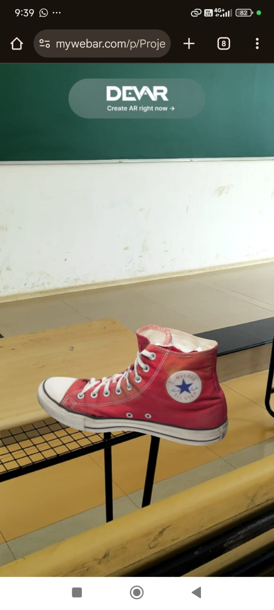

# AR-VR-PROJECT
FOR MY OE ASSIGNMENT

A simple, real-time WebAR project that displays a 3D model in the real world. This experience is built for instant access on mobile devices without requiring an app install.

## 🚀 Live Demo: View in AR

Scan the QR code below with your smartphone's camera to launch the augmented reality experience.

 

Alternatively, if you are on a mobile device, you can click this link:
**[Launch AR Experience](https://mywebar.com/p/Project_0_ndoxegh3hd)**

## 📸 Screenshots

Here is a screenshot of the project in action:

## 🛠️ Technology Stack

* **Augmented Reality:** WebAR (via WebXR)
* **Development Platform:** [MyWebAR](https://mywebar.com/) (No-code platform for rapid AR deployment)
* **Core Principle:** Markerless (On-Surface) AR, which uses SLAM (Simultaneous Localization and Mapping) to detect and track flat surfaces.
* **3D Model Format:** `.GLB` / `.GLTF`

## Project Report

For a detailed breakdown of the project's methodology, challenges, and conclusions, please see the full project report.

[View Full Project Report (PDF)](ASSETS/AR-VR-REPORT.pdf)
